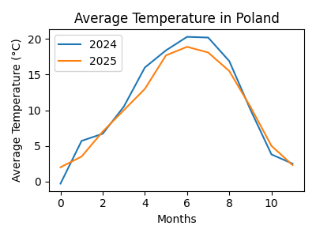

Here is the line plot of the average temperature in Poland for the years 2024 and 2025. The x-axis represents the months, and the y-axis represents the average temperature in degrees Celsius. The plot includes a legend to distinguish the two data series.